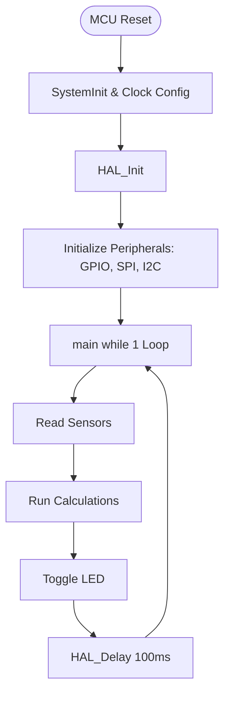

# Welcome to the World of Zephyr RTOS! 🚀

Since you already know **STM32** and **HAL (Hardware Abstraction Layer)**, you are in a fantastic position. You already understand microcontrollers, GPIOs, interrupts, clocks, and registers. 

Zephyr RTOS might look complex at first glance because it introduces a new build system, a hardware description language (**Devicetree**), and operating system concepts. However, once you learn the design patterns, it becomes **extremely fluent** and powerful to build multi-threaded, robust firmware.

---

## 1. What is an RTOS? (vs. Bare-Metal STM32)

In standard bare-metal STM32 development (using STM32CubeIDE), your application follows a **"Super-Loop"** architecture:



### The Bare-Metal Problem:
* **Blocking Delays**: When you call `HAL_Delay(100)`, the CPU sits in a dummy loop, burning power and doing absolutely nothing else.
* **Concurrency Issues**: If you want to sample an accelerometer at 100Hz, read a temperature sensor at 1Hz, and run a Bluetooth stack at the same time, your code becomes a messy combination of timer interrupts, state machines, and global flags.

### The RTOS Solution:
An **RTOS (Real-Time Operating System)** splits your code into independent, isolated loops called **Threads** (or Tasks). 

```mermaid
graph TD
    subgraph RTOS Scheduler
        S[Manages Priorities & Context Switches]
    end
    
    subgraph Thread 1: Sensor Reader (Priority 5)
        T1[Read Accelerometer] --> W1[k_msleep 10]
        W1 --> T1
    end
    
    subgraph Thread 2: LED Blinker (Priority 10)
        T2[Toggle LED] --> W2[k_msleep 500]
        W2 --> T2
    end
    
    S -. Coordinates .-> T1
    S -. Coordinates .-> T2
```

* **Non-blocking Sleep**: When Thread 2 calls `k_msleep(500)`, the RTOS immediately pauses Thread 2, saves its state, and gives 100% of the CPU to Thread 1. No clock cycles are wasted!
* **Deterministic Priorities**: If an emergency event occurs, the scheduler will instantly interrupt lower-priority tasks to run your critical handler.

---

## 2. What is Zephyr? (And How is it Different?)

You might have heard of **FreeRTOS**. FreeRTOS is *just* a scheduler library. You still write STM32 HAL code, manage your own drivers, and manually write ISRs (Interrupt Service Routines).

**Zephyr is a complete operating system ecosystem.** It is modeled after the Linux Kernel:
1. **Integrated Drivers**: Zephyr comes with highly optimized, production-ready drivers for GPIO, SPI, I2C, BLE, USB, Wi-Fi, File Systems, and hundreds of sensors (like the ST accelerometers on your board!).
2. **STM32 HAL Under the Hood**: Zephyr **does not** replace STM32 HAL; **it wraps it!** When you configure an I2C port in Zephyr, Zephyr's driver invokes the exact same STM32 HAL I2C registers under the hood. Your knowledge of STM32 hardware remains completely valid!
3. **Devicetree (DTS)**: Hardware description is separated from C code.
4. **Kconfig**: Configuration options are enabled via simple configuration text files (`.conf`).

---

## 3. Demystifying the Files in Your Folder

You copied the board files for the **STEVAL-STWINBX1** (an industrial sensor node with an ultra-low-power STM32U585 MCU). Let's look at what they do:

### 📄 `board.yml`
This is metadata for Zephyr's build tool (`west`). It tells Zephyr:
* The name of the board is `steval_stwinbx1`.
* It is manufactured by `st`.
* It contains the SoC `stm32u585xx`.

### 📄 `steval_stwinbx1.dts`
This is a **Devicetree Source (DTS)** file. It describes exactly what pins are connected to what hardware.

Let's look at a snippet from your file:
```dts
	leds {
		compatible = "gpio-leds";

		green_led: led_1 {
			gpios = <&gpioh 12 GPIO_ACTIVE_HIGH>;
			label = "LED_1";
		};

		orange_led: led_2 {
			gpios = <&gpioh 10 GPIO_ACTIVE_HIGH>;
			label = "LED_2";
		};
	};
```
* Instead of hardcoding `GPIOH` and `GPIO_PIN_12` in C, this tells the system: "There is a green LED on Port H, Pin 12, which is active high."
* It defines an **alias** for easy access in C:
  ```dts
  aliases {
      led0 = &green_led;
      led1 = &orange_led;
  };
  ```

---

## 4. Comparing the APIs: STM32 HAL vs. Zephyr RTOS

Here is how you perform common tasks in both systems:

### Blinking an LED

**STM32 HAL (Bare-metal):**
```c
// Setup
__HAL_RCC_GPIOH_CLK_ENABLE();
GPIO_InitTypeDef GPIO_InitStruct = {0};
GPIO_InitStruct.Pin = GPIO_PIN_12;
GPIO_InitStruct.Mode = GPIO_MODE_OUTPUT_PP;
HAL_GPIO_Init(GPIOH, &GPIO_InitStruct);

// Loop
while (1) {
    HAL_GPIO_TogglePin(GPIOH, GPIO_PIN_12);
    HAL_Delay(500); // Blocks CPU!
}
```

**Zephyr RTOS API:**
```c
#include <zephyr/kernel.h>
#include <zephyr/drivers/gpio.h>

// 1. Get the LED configuration directly from the Devicetree alias "led0"
static const struct gpio_dt_spec led = GPIO_DT_SPEC_GET(DT_ALIAS(led0), gpios);

int main(void) {
    // 2. Initialize the GPIO
    gpio_pin_configure_dt(&led, GPIO_OUTPUT_ACTIVE);

    // 3. Loop
    while (1) {
        gpio_pin_toggle_dt(&led);
        k_msleep(500); // Non-blocking sleep! Other threads run.
    }
}
```

---

## 5. Setting Up a Demo Project Together

Let's create a real, compile-ready Zephyr project structure in your workspace in a folder called `stwinbx1_blinky`. 

We will structure it exactly like a production Zephyr application:
```text
stwinbx1_blinky/
├── CMakeLists.txt     <- Tells CMake how to build the project
├── prj.conf           <- Kconfig settings (enables GPIO, etc.)
└── src/
    └── main.c         <- Our multi-threaded C code
```

We will implement a **Multi-Threaded Blinker** where:
* **Thread A** blinks the **Green LED** every **350ms**.
* **Thread B** blinks the **Orange LED** every **800ms**.
* Both threads run concurrently, completely independently!

Let's create these files now.
